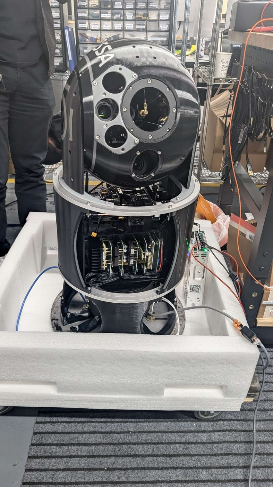
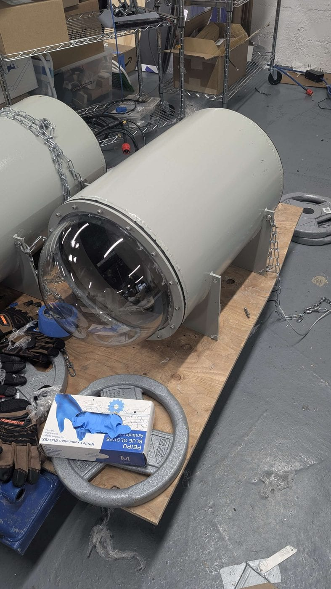

Built during a co-op term at **Thalassa Robotics** in California, on their underwater vehicle platform.

Isaac Sim does not model everything a vehicle operating underwater cares about. Two domains had to be
integrated and configured on top of it: **optics**, for what the cameras would realistically see through
water, and **hydrodynamics**, for how a body moves through it.

The CAD assembly was prepared as a **USD** scene with every joint articulated so the simulated assembly
matched the real one.

I layered control abstractions over Isaac Sim so that the simulated motors are driven through the same
interface as the real servos, with path planning bounded by the machine's real acceleration limits and
an interpolation layer above it for smooth motion.

